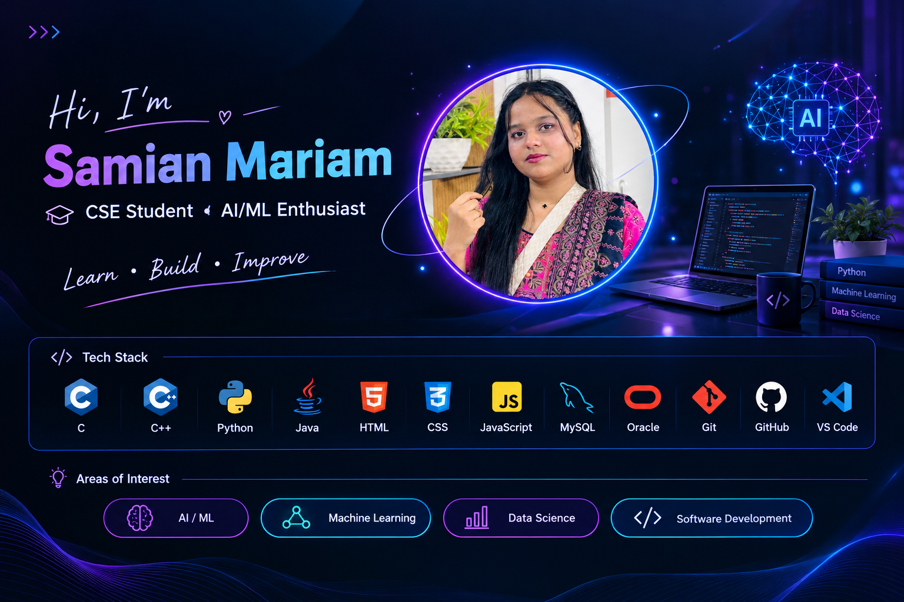
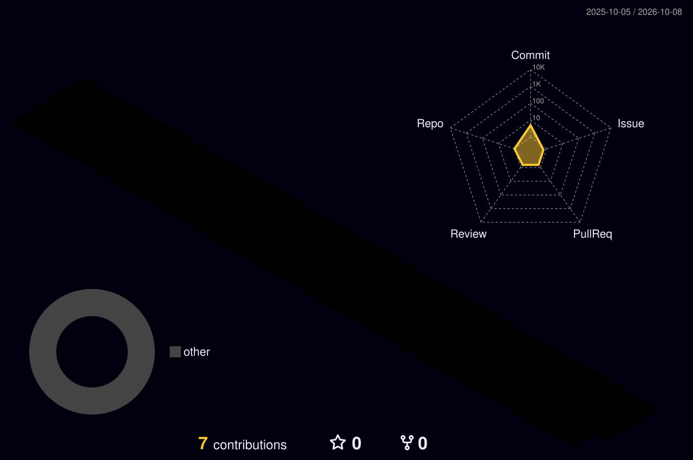

<!-- ╔══════════════════════════════════════════════════════════════════╗ -->
<!-- ║                    RAJ MUKUT // GITHUB PROFILE                     ║ -->
<!-- ╚══════════════════════════════════════════════════════════════════╝ -->

<div align="center">



<br/>


<br/>


<br/>


<br/><br/>

### `DHAKA 🇧🇩`　•　`B.Sc. in CSE 🎓`　•　`FULL-STACK DEVELOPER `

</div>

<table>
<tr>

<td width="52%" valign="top">

### `> WHO_AM_I`

```text
NAME       : Samian Mariam
ROLE       : Network Engineer Software Developer
LOCATION   : Dhaka, Bangladesh 
UNIVERSITY : Northern University Bangladesh
STATUS     : Learning
```

I enjoy transforming **ideas into functional software** through clean interfaces, structured backend architecture and practical database design.

My main interests include:

`Full-Stack Development`

`Backend Engineering`

`Secure Web Applications`

`Database Architecture`

`Software System Design`

</td>

<td width="48%" valign="top">

### `> DEVELOPER.config`

```yaml
developer:
  name: Samian Mariam 

  mindset:
    - Build
    - Learn
    - Improve
    - Repeat

  frontend:
    - React.js
    - JavaScript
    - Tailwind CSS

  backend:
    - Laravel
    - PHP
    - Node.js
    - Express.js

  database:
    - MySQL
    - MongoDB

  mission:
    "Build useful software"
```

</td>

</tr>
</table>

---

<div align="center">

# ⚡ TECHNOLOGY // CORE

### `FRONTEND_INTERFACE`


<br/><br/>

### `BACKEND_ENGINE`


<br/><br/>

### `DATA_LAYER`


<br/><br/>

### `DEVELOPMENT_ENVIRONMENT`


</div>

<br/>

<table>
<tr>

<td width="25%" align="center">

### 🎨

## FRONTEND

`HTML`

`CSS`

`JavaScript`

`React.js`

`Tailwind`

</td>

<td width="25%" align="center">

### ⚙️

## BACKEND

`PHP`

`Laravel`

`Node.js`

`Express.js`

`REST API`

</td>

<td width="25%" align="center">

### 🗄️

## DATABASE

`MySQL`

`MongoDB`

`Data Modeling`

`Relationships`

`Queries`

</td>

<td width="25%" align="center">

### 🔐

## SYSTEMS

`Authentication`

`Authorization`

`Role Access`

`Security`

`Architecture`

</td>

</tr>
</table>

---

<div align="center">

# ◈ SYSTEM // ARCHITECTURE

```text
                         ┌─────────────────┐
                         │      USER       │
                         └────────┬────────┘
                                  │
                                  ▼
                    ┌─────────────────────────┐
                    │     USER INTERFACE      │
                    │                         │
                    │ React • JS • Tailwind   │
                    └────────────┬────────────┘
                                 │
                                 ▼
                    ┌─────────────────────────┐
                    │    APPLICATION LAYER    │
                    │                         │
                    │ Laravel • PHP • Node.js │
                    └────────────┬────────────┘
                                 │
                 ┌───────────────┴────────────────┐
                 │                                │
                 ▼                                ▼
       ┌───────────────────┐           ┌───────────────────┐
       │ AUTH / SECURITY   │           │ BUSINESS LOGIC    │
       └─────────┬─────────┘           └─────────┬─────────┘
                 │                               │
                 └───────────────┬───────────────┘
                                 │
                                 ▼
                    ┌─────────────────────────┐
                    │       DATA LAYER        │
                    │                         │
                    │    MySQL • MongoDB      │
                    └────────────┬────────────┘
                                 │
                                 ▼
                    ┌─────────────────────────┐
                    │    WORKING PRODUCT      │
                    └─────────────────────────┘
```

### `IDEA → ARCHITECTURE → DEVELOPMENT → PRODUCT`

</div>

---

<div align="center">

# 🚀 PROJECT // COMMAND CENTER

### `REAL PROBLEMS. PRACTICAL SOFTWARE.`


</div>

<br/>

<table>
<tr>

<td width="50%" valign="top">


# 📡 LIVE // DEVELOPER TELEMETRY

### `REAL-TIME GITHUB DATA`

<br/>


<br/><br/>

### `COMMIT_STREAK`


</div>

---

<div align="center">

# 📈 ACTIVITY // SIGNAL

### `CONTRIBUTION STREAM`


</div>

---

<div align="center">

# 🌌 3D // CONTRIBUTION UNIVERSE

### `365 DAYS OF DEVELOPMENT`



<br/>

```text
╔══════════════════════════════════════════════════════════╗
║                                                          ║
║               CONSISTENCY BUILDS MASTERY                 ║
║                                                          ║
╚══════════════════════════════════════════════════════════╝
```

</div>

---

<div align="center">

# 🧠 DEVELOPMENT // PIPELINE

</div>

<table>
<tr>

<td width="20%" align="center">

### `01`

# 💡

### DISCOVER

Understand  
the problem

</td>

<td width="20%" align="center">

### `02`

# 🧩

### DESIGN

Plan  
architecture

</td>

<td width="20%" align="center">

### `03`

# 💻

### DEVELOP

Build  
the system

</td>

<td width="20%" align="center">

### `04`

# 🧪

### TEST

Find and  
fix issues

</td>

<td width="20%" align="center">

### `05`

# 🚀

### EVOLVE

Optimize  
and improve

</td>

</tr>
</table>

<div align="center">

```text
   DISCOVER          DESIGN           DEVELOP           TEST            EVOLVE
      │                │                 │                │                │
      ▼                ▼                 ▼                ▼                ▼
 ┌─────────┐      ┌─────────┐       ┌─────────┐      ┌─────────┐      ┌─────────┐
 │ PROBLEM │ ───► │ SYSTEM  │ ────► │  CODE   │ ───► │ QUALITY │ ───► │ PRODUCT │
 └─────────┘      └─────────┘       └─────────┘      └─────────┘      └─────────┘
```

</div>

---

<div align="center">

# 🎯 MISSION // 2026

</div>

<table>
<tr>

<td width="33%" align="center">

# ⚡

### BUILD

More complete  
real-world  
applications.

</td>

<td width="33%" align="center">

# 🧠

### MASTER

Backend architecture,  
security and  
system design.

</td>

<td width="33%" align="center">

# 🌍

### IMPACT

Build software  
that creates  
real value.

</td>

</tr>
</table>

<br/>

<div align="center">

```text
╭──────────────────────────────────────────────────────────────────╮
│                                                                  │
│                      DEVELOPMENT RADAR                           │
│                                                                  │
│  FULL-STACK DEVELOPMENT        ███████████████████░              │
│                                                                  │
│  BACKEND ENGINEERING           ████████████████████              │
│                                                                  │
│  DATABASE ARCHITECTURE         ██████████████████░░              │
│                                                                  │
│  APPLICATION SECURITY          ██████████████████░░              │
│                                                                  │
│  SYSTEM DESIGN                 █████████████████░░░              │
│                                                                  │
│  CONTINUOUS LEARNING           ████████████████████              │
│                                                                  │
╰──────────────────────────────────────────────────────────────────╯
```

</div>

---

<div align="center">

# 🖥️ DEVELOPER // TERMINAL

```bash
samianmariam@github:~$ whoami
Samian Mariam

samianmariam@github:~$ cat role.txt
Full-Stack Developer

samianmariam@github:~$ cat location.txt
Dhaka, Bangladesh 🇧🇩

raj@github:~$ cat education.txt
B.Sc. in Computer Science & Engineering
Northern University Bangladesh

samianmariam@github:~$ ./current_mission.sh

[✓] Build useful software
[✓] Improve architecture
[✓] Write cleaner code
[✓] Learn continuously
[✓] Solve real-world problems

raj@github:~$ echo $MINDSET
Build → Learn → Improve → Repeat

raj@github:~$ _
```

</div>

---

<div align="center">

# ⚙️ SYSTEM // STATUS

```text
╔════════════════════════════════════════════════════════════════╗
║                     DEVELOPER SYSTEM                          ║
╠════════════════════════════════════════════════════════════════╣
║                                                                ║
║  USER          Samian Mariam                                    ║
║  ROLE          Full-Stack Developer                           ║
║  LOCATION      Dhaka, Bangladesh                         ║
║  EDUCATION     B.Sc. in CSE                                   ║
║  UNIVERSITY    Northern University Bangladesh                 ║
║                                                                ║
║  BUILD MODE    ████████████████████  ONLINE                   ║
║  LEARNING      ████████████████████  CONTINUOUS               ║
║  CURIOSITY     ████████████████████  MAXIMUM                  ║
║  COFFEE        ███████████████████░  REQUIRED                 ║
║                                                                ║
║  SYSTEM STATUS ● OPERATIONAL                                  ║
║                                                                ║
╚════════════════════════════════════════════════════════════════╝
```

</div>

---

<div align="center">

# 💎 ENGINEERING // PRINCIPLES

</div>

<table>
<tr>

<td width="25%" align="center">

### `01`

## CLEAN

Readable code.

Maintainable structure.

</td>

<td width="25%" align="center">

### `02`

## SECURE

Protect users.

Protect data.

</td>

<td width="25%" align="center">

### `03`

## SCALABLE

Design beyond  
today.

</td>

<td width="25%" align="center">

### `04`

## USEFUL

Solve actual  
problems.

</td>

</tr>
</table>

---

<div align="center">

# 💭 DEVELOPER // MANIFESTO

<br/>

### `I don't want to build software just because I can.`

### `I want to build software because it solves something.`

<br/>

```text
                    THINK DIFFERENTLY
                           │
                           ▼
                    DESIGN CAREFULLY
                           │
                           ▼
                     BUILD CLEANLY
                           │
                           ▼
                      TEST DEEPLY
                           │
                           ▼
                     IMPROVE DAILY
```

<br/>

> ## `IDEAS BECOME VALUABLE WHEN THEY BECOME USEFUL SOFTWARE.`

</div>

---

<div align="center">

# 🌐 CONNECTION // PORT

### `READY FOR THE NEXT BUILD`


<br/>

### `💻 CODE`　→　`⚙️ BUILD`　→　`🧠 LEARN`　→　`🔥 IMPROVE`

<br/>

```text
╔══════════════════════════════════════════════════════════════════╗
║                                                                  ║
║                       THANKS FOR VISITING                        ║
║                                                                  ║
║                         Samian Mariam                            ║
║                                                                  ║
║                      FULL-STACK DEVELOPER                        ║
║                                                                  ║
║                DHAKA, BANGLADESH  • WORLD                        ║
║                                                                  ║
╚══════════════════════════════════════════════════════════════════╝
```

<br/>


<br/>


</div>

<!-- ═══════════════════════════════════════════════════════════════ -->
<!--                   END // RAJ MUKUT                           -->
<!-- ═══════════════════════════════════════════════════════════════ -->
